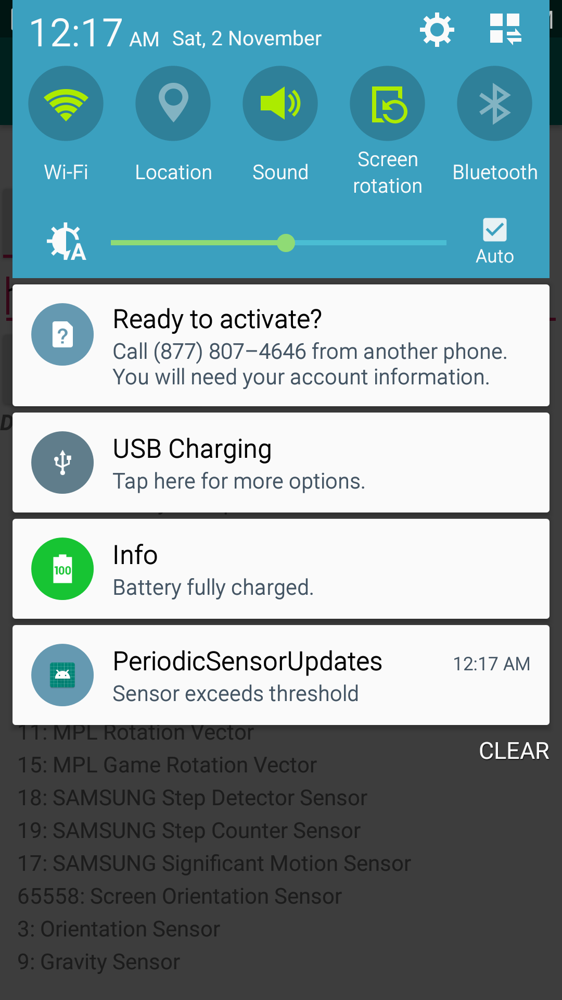

# PeriodicSensorUpdates
This Android template project let user choose a sensor available on the device, and set it up for alert. When the sensor detects a value above a threshold, the user receives a notification.

### MainActivity
The MainActivity provides an interface for the user to configure the settings:
1. The type of sensor 
2. The threshold that triggers a notification
3. Turn on/off the service

### SensorSerivce
The sensor is tested on a service, which registers itself as a sensor listener. When the sensor reports a value above the threshold, the service broadcasts an alert request.

## Screenshots

 
